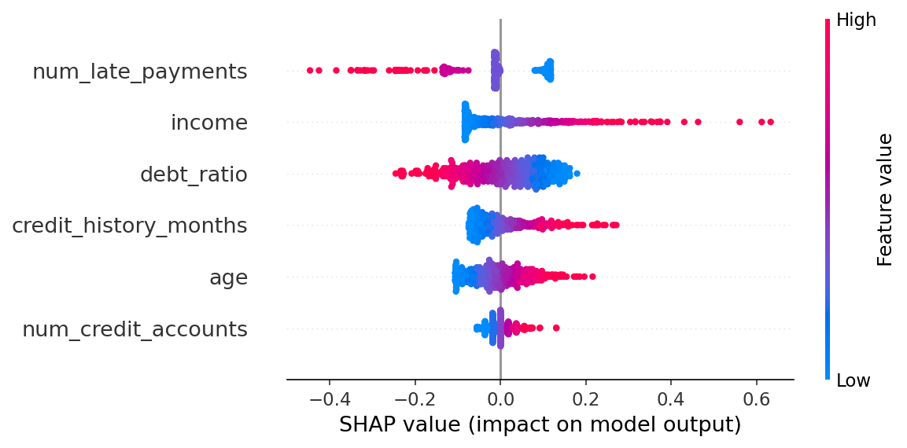
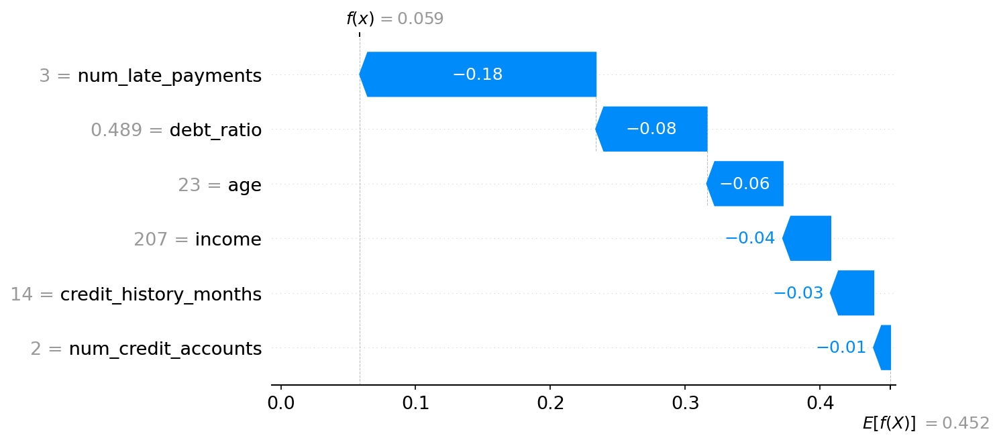

# Telco Credit Assessment Pipeline

This project builds a comprehensive End-to-End machine learning pipeline to assess the creditworthiness of applicants for telephone company subscriptions. It simulates the entire lifecycle of a credit scoring project from data generation to API deployment.

## Project Structure

```
telco_credit_assessment/
├── data/
│   ├── raw/                  # Generated synthetic data
│   └── processed/            # Trained models and augemented datasets
├── reports/                  # Analysis reports and charts
└── src/
    ├── generate_data.py            # Step 1: Generate synthetic telecom data
    ├── generate_report.py          # Step 2: EDA and HTML report generation
    ├── train_scoring_model.py      # Step 3: Train baseline Logistic Regression
    ├── reject_inference.py         # Step 4: Concept proof of reject inference
    ├── reject_inference_methods.py # Step 4-2: Compare Hard Cutoff, Fuzzy, Parceling
    ├── ks_analysis.py              # Step 5: KS Analysis class and plotting
    ├── final_comparison.py         # Step 6: Compare all models
    ├── create_scorecard_policy.py  # Step 7: Create Scorecard and Policy Rules
    ├── app.py                      # Step 8: FastAPI Server
    └── load_test.py                # Step 9: Load testing script
```

## How to Run

1.  **Install Dependencies:**
    ```bash
    pip install pandas numpy scikit-learn matplotlib plotly joblib fastapi uvicorn requests pydantic
    ```

2.  **Run Pipeline Steps:**
    ```bash
    # 1. Generate Data
    python src/generate_data.py
    
    # 2. Generate EDA Report
    python src/generate_report.py
    
    # 3. Train Baseline Model
    python src/train_scoring_model.py
    
    # 4. Perform Reject Inference & Compare Methods
    python src/reject_inference_methods.py
    
    # 5. Create Final Scorecard & Policy
    python src/create_scorecard_policy.py
    ```

3.  **Run API Server:**
    ```bash
    python src/app.py
    ```
  

4.  **Run Load Test (in another terminal):**
    ```bash
    python src/load_test.py
    ```

## Key Results
- **Selected Method:** Parceling (or Hard Cutoff depending on run)
- **Max KS:** ~40-50%
- **Policy:** Auto-Approve (>= 600), Review (550-600), Reject (< 550)

### 🔍 Model Explainability (XAI)
To ensure transparency in our credit decisions, I implemented **SHAP** analysis:
- **Global Interpretation:** Visualized the primary drivers of default risk across the entire population.
- **Local Interpretation:** Provided clear "Reason Codes" for individual loan denials using Waterfall plots.


*Figure 1: Global feature importance showing the impact of variables on the model output.*


*Figure 2: Waterfall plot showing feature contributions for a specific prediction.*

## Author
Generated by Google Deepmind 'Antigravity' AI Assistant.
